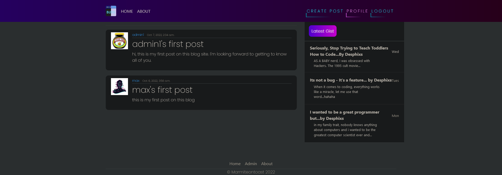

<h1 align="center">BlogProj</h1>

[You can view the live project here.](https://blogproj-project-4.herokuapp.com/login/)

This is a blog site designed for people of all ages and backgrounds to come together and talk about coding

<h2 align="center"></h2>

 # User Experience (UX)

## User stories 

- As a site user i can view a paginated list of posts so that easily select a post to view
- As a site user I can view a list of posts so that I can select one to read 
- As a site user I can click on a post so that I can read the whole text
- As a site user/admin I can view comments on indivdual post so that I  can read the conversation
- As a site user I can register an account so that I can comment on posts
- As a site admin I can create, read, update and delete posts so that I can manage my blog content
- As a site admin I can creae draft posts so that I can finish writing the content later
- As a site admin I can approve or disaprove comments so that I can filter out objectionable comments

# Features

# Technologies Used

## Languages Used

- [HTML](https://en.wikipedia.org/wiki/HTML5)
- [css](https://en.wikipedia.org/wiki/CSS)
- [python](https://en.wikipedia.org/wiki/Python_(programming_language))

## Frameworks, Libraries and Programs Used

1. [Djano:](https://www.djangoproject.com/)
    - Djano was used to get my website running in a relatively short space of time. 

2. [Bootstrap 4.6:](https://getbootstrap.com/docs/4.6/getting-started/introduction/)
    - Bootstrap was used to help with the websites responsiveness.

3. [Git:](https://git-scm.com/)
    - Git was used to within the gitpod terminal to Git commit and push to GitHub.

4. [GitHub:](https://github.com/)
    - GitHub is used to store the projects after being pushed from Git.

5. [Heroku:](https://id.heroku.com/login)
    - Heroku is used to for deployment for backend related projects

6. [Cloudinary:](https://cloudinary.com/) 
    - Cloudinary is used to store the websites static and media content

# Deployment

## Heroku

The project was deployed on Heroku using the following steps

1. In heroku create a new app 
2. click the resource tab locatated at the top of the page, search and add "Heroku Postgres"
3. in the settings tab, reveal Config Vars and copy "DATABASE_URL"

### In gitpod:

4. Create an envy.py file in the main directory

### In envy.py:

5. Import the os library
6. input os.environ["DATABASE_URL"] = "Paste in Heroku DATABASE_URL Link"
7. add a secret key os.environ["SECRET_KEY"] = "Make up your own randomSecretKey"

### In Heroku

8. add secret key to Config Vars SECRET_KEY, “randomSecretKey”

In setting.py: 

9. Reference env.py  

10. Remove the insecure secret key and replace links to the SECRET_KEY variable on Heroku SECRET_KEY = os.environ.get('SECRET_KEY')

11. Comment out the default DataBases Section

12. Add new Databases  DATABASES = {
   'default': dj_database_url.parse(os.environ.get("DATABASE_URL"))
}

13. you'll need to create a Procfile in the main directory, within the file add code web: gunicorn PROJ_NAME.wsgi

Credits

The code came is from [Destiny Franks(Desphixs)](https://www.youtube.com/c/Desphixs) a youtuber and resident of GitHub

    

