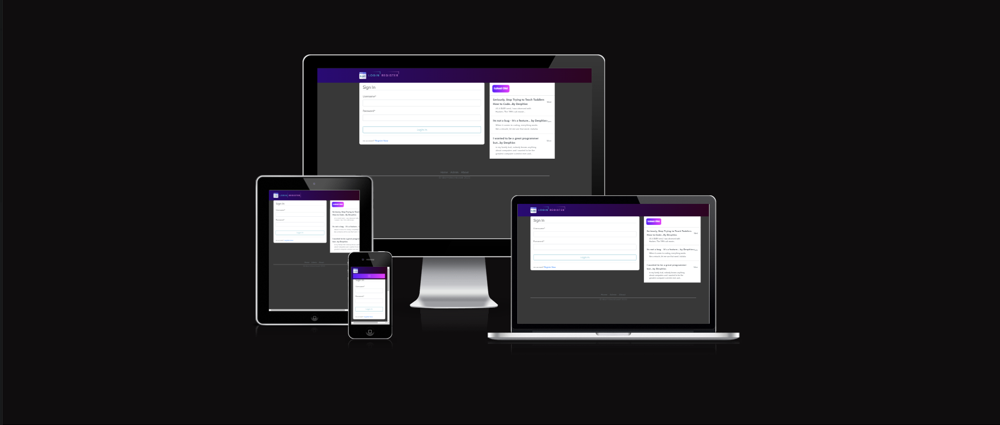
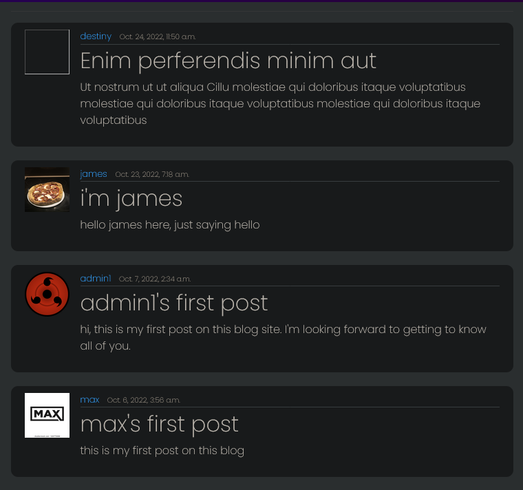
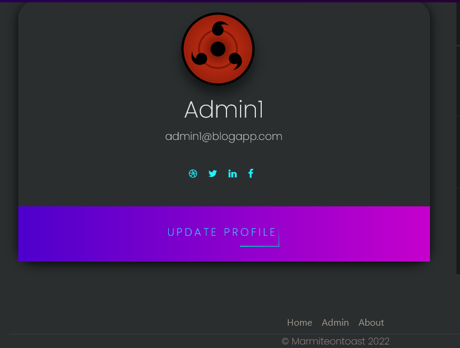
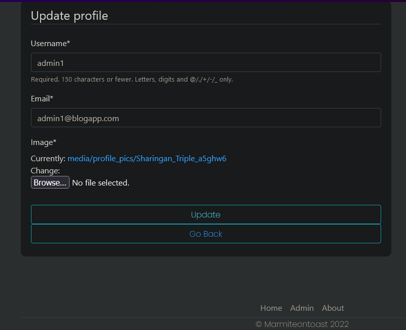
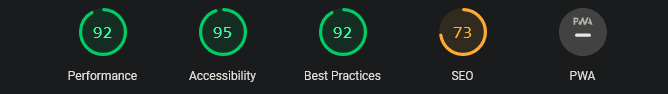
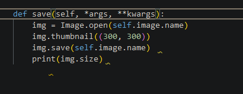
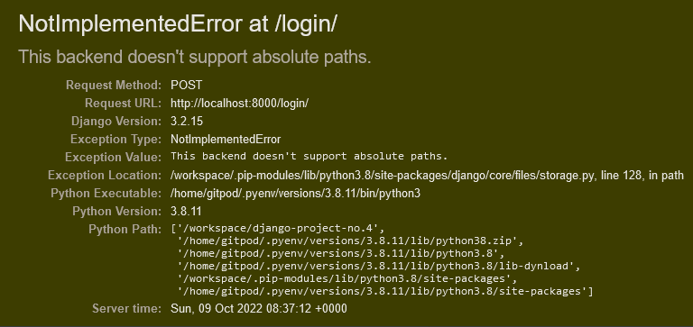

<h1 align="center">BlogProj</h1>

[You can view the live project here.](https://blogproj-project-4.herokuapp.com/login/)

This is a blog site designed for people of all ages and backgrounds to come together and talk about coding

<h2 align="center"></h2>

 # User Experience (UX)

## User Stories 

- As a site user i can view a paginated list of posts so that easily select a post to view
- As a site user I can view a list of posts so that I can select one to read 
- As a site user I can click on a post so that I can read the whole text
- As a site user/admin I can view comments on indivdual post so that I  can read the conversation
- As a site user I can register an account so that I can comment on posts
- As a site admin I can create, read, update and delete posts so that I can manage my blog content
- As a site admin I can creae draft posts so that I can finish writing the content later
- As a site admin I can approve or disaprove comments so that I can filter out objectionable comments

# Features

## Navigation
- on the login page there is the "Login" and "Register" buttons at the top of the page
<h2></h2>

- but once signed in to a user account those buttions will change to "Home", "About", "Create Post", "Profile", and "Logout"
<h2></h2>

## Home Page
- At the home page you can see all the post from all the users in a paginated list. the top post being the most recent. 
- The users profile pic is also rendered on the left side of the post so to better identify who posted it

<h2></h2>

## Profile Page

- the user has a page show the user's profile image as well as their email address 
- the user has access to the various social media links
- at the bottom of that there is an update button where you can update your contact information and upload a profile image 

<h2></h2>

## Update Page

- At the update page the user is able to update thier contact information
- the user can change their username 
- they can also change their profile image

<h2></h2>

# Technologies Used

## Languages Used

- [HTML](https://en.wikipedia.org/wiki/HTML5)
- [css](https://en.wikipedia.org/wiki/CSS)
- [python](https://en.wikipedia.org/wiki/Python_(programming_language))

## Frameworks, Libraries and Programs Used

1. [Djano:](https://www.djangoproject.com/)
    - Djano was used to get my website running in a relatively short space of time. 

2. [Bootstrap 4.6:](https://getbootstrap.com/docs/4.6/getting-started/introduction/)
    - Bootstrap was used to help with the websites responsiveness.

3. [Git:](https://git-scm.com/)
    - Git was used to within the gitpod terminal to Git commit and push to GitHub.

4. [GitHub:](https://github.com/)
    - GitHub is used to store the projects after being pushed from Git.

5. [Heroku:](https://id.heroku.com/login)
    - Heroku is used to for deployment for backend related projects

6. [Cloudinary:](https://cloudinary.com/) 
    - Cloudinary is used to store the websites static and media content

# Testing 

## Lighthouse

<h2></h2>

Lighthouse Chrome dev tool was run. results are positive for performance, Accessibility and Best Practices, but SEO was a little low.

## Automated Testing 

Automated was not added due to time restraints for the project 

## Manuel Tests 

- users - users are able to register and login 
- home page - users are able to see theres and other users posts in the home page in the form of a list
- profile page - users are able go to their profile page and see there profile image aswell as upload a profile image
- site admin - admin can manage users and blog posts in the backend. also can update user profiles and information 

## code issues 
- an error on my part, i felt the need to write a save function for the new image instance aswell as change the size of the image, so the files are not too large. It was this very issue that was preventing "ClourinaryMediaStorage" from working preventing me from deploying my blog site. But after speaking to people far more knowledgable than me I choose to remove it. After that my uploading images to Cloudinary started working fine.

<h2></h2>

- also using 'path' was a major issue as well (cloudinary doesn't like absolute paths) changing it to 'name' solved that problem. but the whole function need re-writing 

<h2></h2>

## Unsolved Bugs

- Currently unable to render a default image when people first register for an user account 

# Deployment

## Heroku

The project was deployed on Heroku using the following steps

1. In heroku create a new app 
2. click the resource tab locatated at the top of the page, search and add "Heroku Postgres"
3. in the settings tab, reveal Config Vars and copy "DATABASE_URL"

### In gitpod:

4. Create an envy.py file in the main directory

### In envy.py:

5. Import the os library
6. input os.environ["DATABASE_URL"] = "Paste in Heroku DATABASE_URL Link"
7. add a secret key os.environ["SECRET_KEY"] = "Make up your own randomSecretKey"

### In Heroku

8. add secret key to Config Vars SECRET_KEY, “randomSecretKey”

In setting.py: 

9. Reference env.py  

10. Remove the insecure secret key and replace links to the SECRET_KEY variable on Heroku SECRET_KEY = os.environ.get('SECRET_KEY')

11. Comment out the default DataBases Section

12. Add new Databases  DATABASES = {
   'default': dj_database_url.parse(os.environ.get("DATABASE_URL"))
}

13. you'll need to create a Procfile in the main directory, within the file add code web: gunicorn PROJ_NAME.wsgi

# Credits

## Code

- The code came is from [Destiny Franks(Desphixs)](https://www.youtube.com/c/Desphixs) a youtuber and resident of GitHub

- bootstrap4 for its Grid System making the site responsive 

## Media

- all images are either original or taken from google

## Acknowledgements 

- [Destiny Franks(Desphixs)](https://www.youtube.com/c/Desphixs) we correspond via email. nice guy.

    

